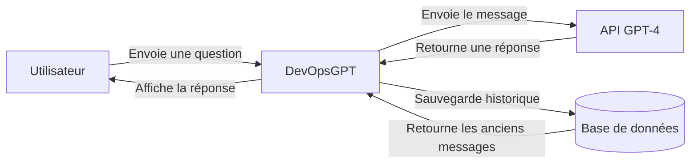

# Diagramme de contexte — DevOpsGPT

```mermaid
flowchart LR
    U[Utilisateur] -->|Envoie une question| S[DevOpsGPT]
    S -->|Affiche la réponse| U

    S -->|Envoie le message| API[API GPT-4]
    API -->|Retourne une réponse| S

    S -->|Sauvegarde historique| DB[(Base de données)]
    DB -->|Retourne les anciens messages| S
```