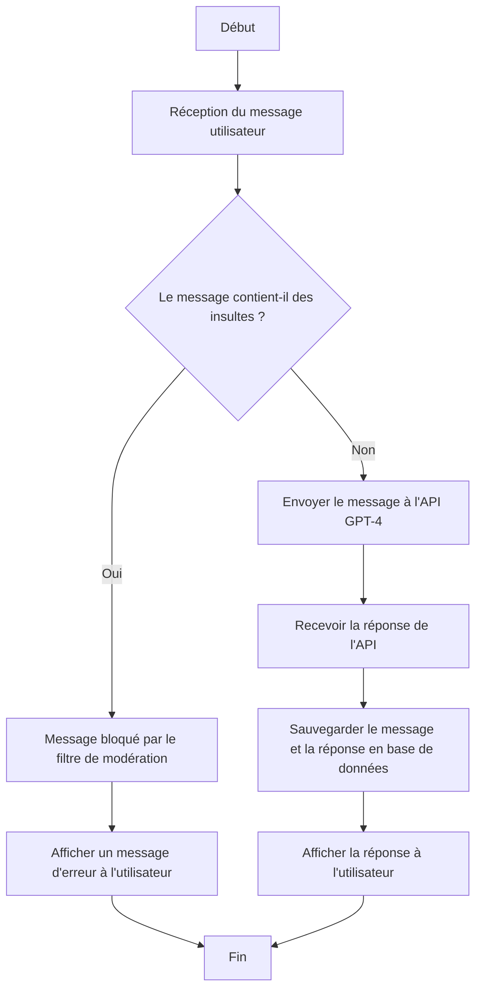

# Flowchart — Traitement d'un message utilisateur

```mermaid
flowchart TD
    A[Début] --> B[Réception du message utilisateur]
    B --> C{Le message contient-il des insultes ?}

    C -->|Oui| D[Message bloqué par le filtre de modération]
    D --> E[Afficher un message d'erreur à l'utilisateur]
    E --> F[Fin]

    C -->|Non| G[Envoyer le message à l'API GPT-4]
    G --> H[Recevoir la réponse de l'API]
    H --> I[Sauvegarder le message et la réponse en base de données]
    I --> J[Afficher la réponse à l'utilisateur]
    J --> F[Fin]
```
